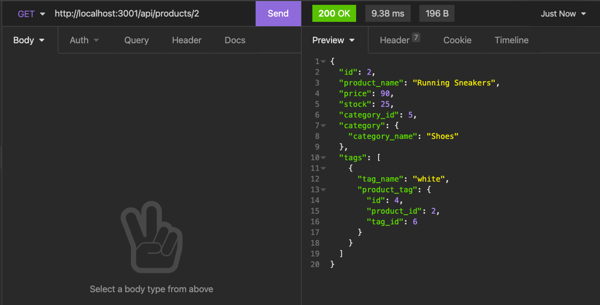
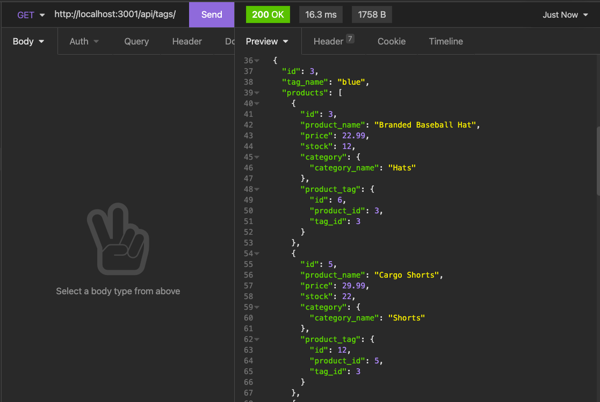

# E-commerce Database

## Description
This week's project is to build the back end for an e-commerce site, configuring the Express.js API to use Sequelize to interact with a MySQL database.

Multiple API Routes are set up to Perform RESTful CRUD Operations: read all categories, products and tags;
read a single category; product and tag; create a category, product and tag; update a category, product and tag; delete a category, product and tag. 

The returned products have assosicated category and tag data; the returned categories have associated product data; the returned tags have assosicated product data.

## Built With
* Node.js
* Express.js
* Sequelize
* MySQL2 package
* MySQL database

## Walk-through video
<https://drive.google.com/file/d/1_6v-kBoweLatOOs7UgyUXgRPTAnV7ZB7/view>

## Contribution
< > with ❤️  by Serena Guo

## Screenshots

